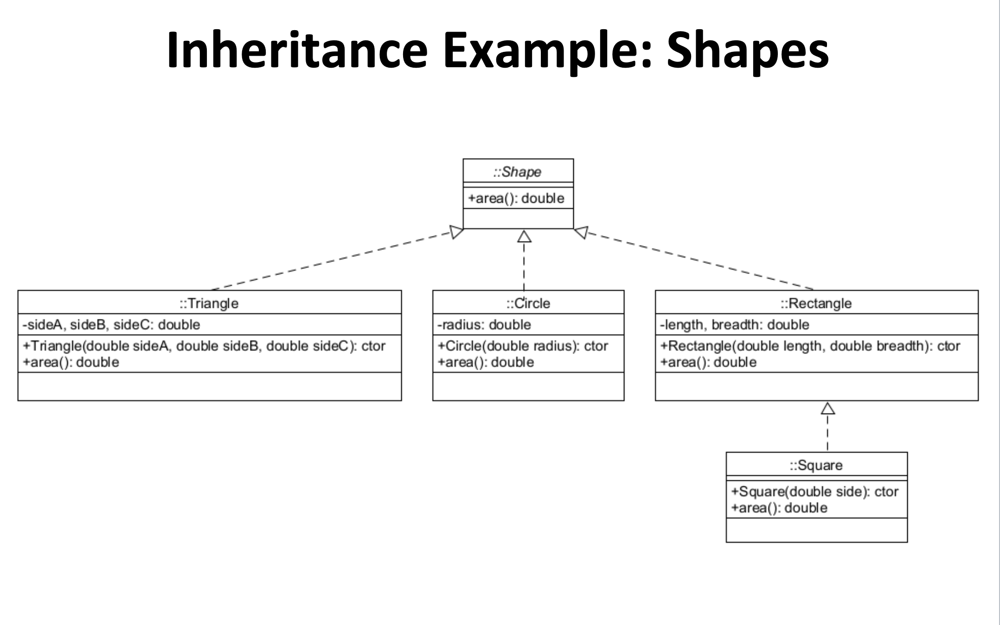

# class_notes_2
## 9-13 Notes
### Discussion of Exams Dates
* 10/6
* 11/3
* 12/13

### Example of Try Catch
 This will be useful for project 1
```
Try {
    ....
}
Catch (Exception e ) {
    ....
}
```

It is important to log these errors in a professional setting. However for project 1,
we can just print out the exception

Learn [class localDate](https://docs.oracle.com/javase/8/docs/api/java/time/LocalDate.html) for project 

### Inheritance and Polymorphism

- Aggregation (Has-A) is a one-way to share data between classes
- Inheritance is another way to share data between classes. This brings polymorphism


When specifying **Extends** in UML we use an arror


When specifying **Protected*** in UML use **#**

## 9-15 Notes

Discussion of modeling relationships

- Inheritance can be bad is done incorrectly.
- Inheritance breaks encapsulation if we use the protected keyword

### Use Private ot Protected Data?

- For now, stick with private

### Objects and Arrays

- Do not pass around references.


### In Class Coding


### UML Diagram of Shapes with Square



- The Square class extends rectangle.


## 9-17 Notes

- Project 1 due 9/22
* toString()
* The . matters

-Discussion 
